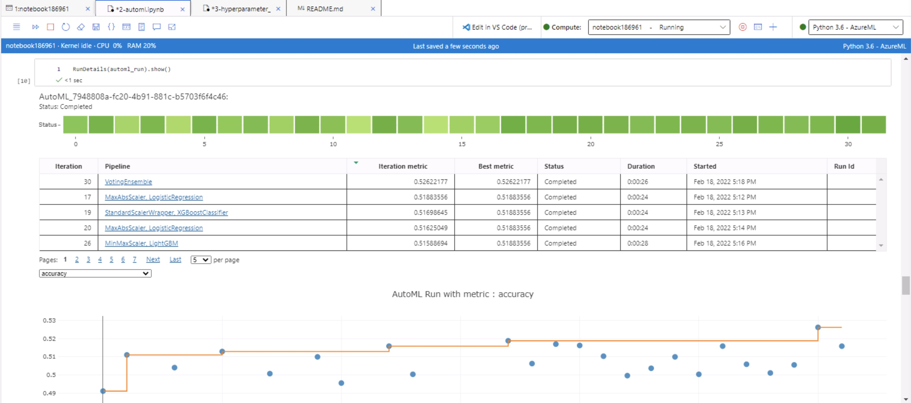
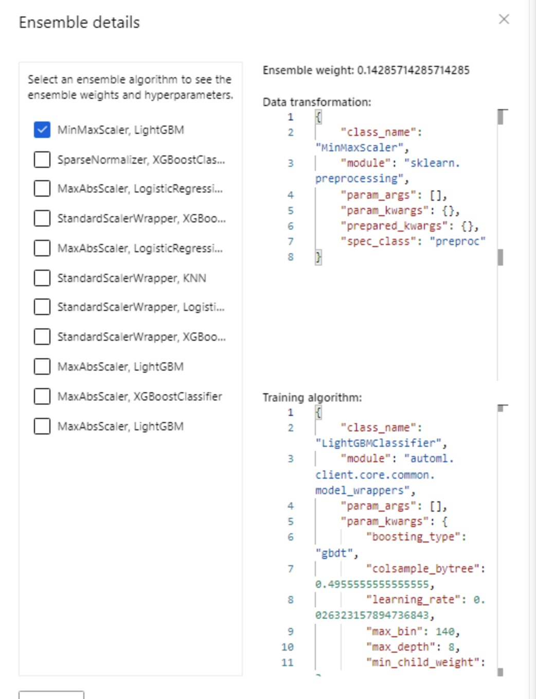
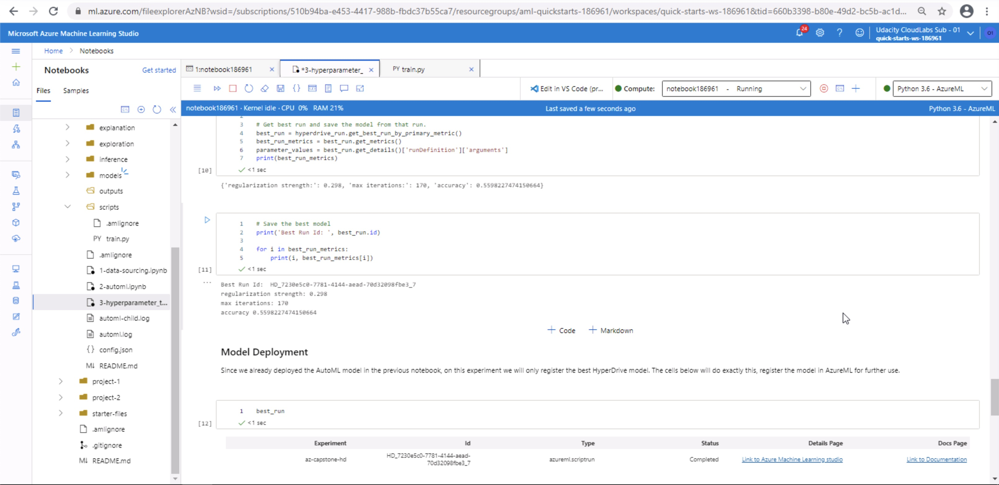
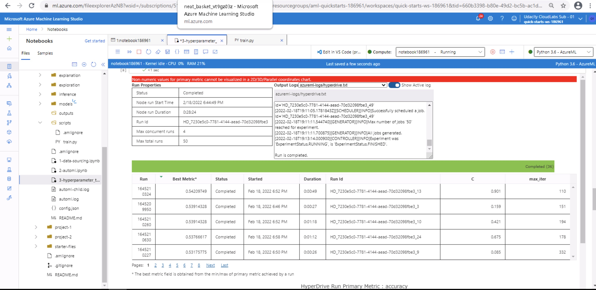
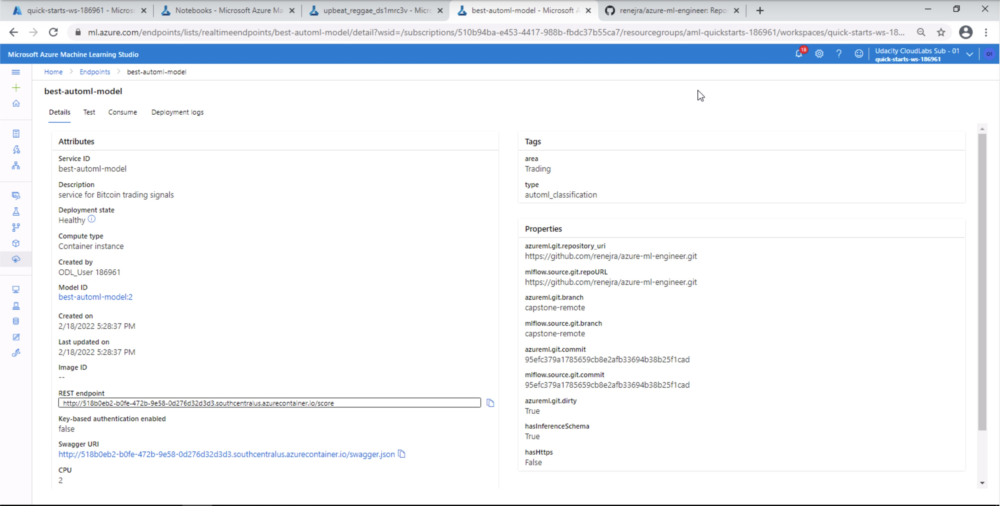

# Using AzureML for Bitcoin trading signals

This is my capstone project for Udacity's ML Engineer in Azure nanodegree. In this project, I will use AzureML
capabilities to train, tune and deploy a machine learning powered trading signal, to predict whether on the next day,
Bitcoin prices would go up (BUY, 1), down (SELL, -1) or stay around the same (HOLD, 0).

## Project Set Up and Installation

In order to run this project in AzureML, you will need certain libraries installed. The easiest way to do this is to install
conda, and run the following line on a terminal within the `/casptone` directory:
```bash
conda env create --file envs/env.yml --name <your_env_name>
```
The provided `env.yml` file is a minimalistic one aimed for use in AzureML.
In case you also wish to run the data sourcing and feature engineering notebook, please also install the necessary
libraries found in `envs/data_env.yml` with a similar command.

This will install all dependencies needed for this project, creating an environment with a given name of yours. 
This file is also used within AzureML, to download relevant dependencies into a reproducible environment, that we can use
to train, tune and deploy our models on the cloud platform with ease.

In order for the data sourcing and preprocessing part to work, you will additionally need to setup a Quandl account,
and input your Quandl Api Key as an environment variable.

```bash
export QUANDLKEY="your-quandl-api-secret"
```
For the notebooks to be able to connect to your relevant Azure subscription and ML Studio
instance, you will need to provide a `config.json` file in the following format:
```bash
{
    "subscription_id": "<subscription-id>",
    "resource_group": "<resource-group>",
    "workspace_name": "<workspace-name>"
}
```
This file is loaded on the [automl notebook](2-automl.ipynb) and the [hyperdrive](3-hyperparameter_tuning.ipynb) one
to create a connection with your AzureML resources.

## Dataset

### Overview
The data I will be using includes only **external resources outside of Azure environment** for which I've created
a separate notebook for data sourcing and feature engineering. The data includes financial data 
(like important stock indices, volume, interest rates, money supply...), 
Bitcoin fundamentals (transactions, transaction cost, hashrate...), commodity prices (gold, silver, oil), and 
relevant technical indicators that traders use (moving averages, Stochastic Relative Strenght Index,
standard deviation...). Financial data and commodities price were sourced from Yahoo Finance using `yfinance` library, 
fundamentals were sourced using `Quandl` and technical indicators were all self-developed. You will find the 
functions for these technical indicators on the `data_utils` folder.

On the [data sourcing notebook](1-data-sourcing.ipynb) you will find all the steps done to get and preprocess the data.
Running the notebook will create CSV files on the `data/` directory. These files are then registered on AzureML
in the relevant AutoML and HyperDrive notebooks, from which they are taken for training and tuning models.

### Task
The task I will be using the Dataset for, is a **classification** task. My aim is to use the data mentioned above
to predict on a day-ahead basis if the asset returns will be on the top 25% most positive returns (BUY, 1), 
the 25% most negative days (SELL, -1) or everything in between (HOLD, 0). While this project is focusing on Bitcoin
prices, this approach is generally extensible to any other asset class, as long as we have reasons to believe
that there is a certain relationship with the financial market.

It is important to note, that the datasets we will take for the next steps differ depending on their nature. 
Since by using AutoML all the data transformation, normalization and standarization is handled by Azure, 
we will feed in a non-treated copy of the dataset. 
On the other hand, as we need to tune in our parameters ourselves on HyperDrive experiment, we will also take care of
the data transformation, normalization and standarization steps, that should be important for the model to converge.

### Access
The access to the data is done on each notebook initially by reading the relevant CSV file on the `data/` directory,
but they are then registered on AzureML as a Dataset prior training. If you want to have a look into
how the data was sourced in detail, please check the [data sourcing notebook](1-data-sourcing.ipynb).

## Automated ML
Our AutoML run was configured to have the *classification task* of predicting next day’s buy, sell or hold label, 
or the column `y_c_shift`. Our primary metric will be **accuracy**, 
as we need a metric we can compare later with HyperDrive and considering that our problem doesn’t 
have particular implications on false positives or negatives, that would make us opt for recall or precision instead. 
I’m also adding the `automatic featurization`, so AutoML takes care of necessary data transformations, 
trying out different methods.  As timeout for this project I used *30 minutes*, to put a cap on how long this will take. 
Also, the usage of VMs to access Azure on a limited time (1h) added pressure on this metric.

### AutoML Results

The best performing model from AutoML was a **voting ensemble, with around 52% accuracy**, which was the primary metric.
Other metrics, like AUC weighted were a bit better at around 66%. The models that came behind the voting ensemble, include
logistic regression (the one we'll tune later, by the way) XGBoost classifier and LightGBM, amongst others.



The best performing model (voting ensemble), uses a weighted ensemble of many other models. Parameters can be seen
below.



I believe our model is not performing so nicely, as I really limited the training time of our experiment (30 min), and
also as I fed in a non-treated dataset to try out AutoML's featurization. 
Anyhow, the approach indeed tried different featurization possibilities like MinMaxScaling,
StandardScalerWrapper and more. If I'd like to improve this model's performance I would either include more features,
try out different transformations, or increase the max allowed training time for our experiment.

## Hyperparameter Tuning

The model that we will be training can be found in the train.py file, where we setup the training run by importing necessary libraries, 
preparing and splitting the data, and finally setting up the main training function. 
We picked for this task a **Logistic Regressor** from `scikit-learn`, 
as it works well for multi-label classification within tasks where we do not have a big amount of data.

For tuning our model, we used `random parameter sampling` over the parameters “C” (inverse regularization strength) and “max_iter” (maximum iterations). 
Randomness is a good way to go through a set of values without compromising too much the computational resources needed.
- **C** (inverse regularization strength): Smaller values implies stronger regularization (or generalization) of the model to unseen data.
On this parameter we selected a random choice of values from 0.001 to 1.
- **max_iter** (maximum iterations): Maximum numbers of iterations for the solvers to converge. A higher amount of iterations imply a more (over-) fitted model.
For this parameter we selected a random choice of values from 100 to 500.

As a termination policy, we picked the **BanditPolicy**, which uses a slack criteria to terminate the policy. 
Basically, the bandit policy terminates the run if new models do not perform within a 
given percentage range of the top accuracy gotten in previous trainings.

In order to compare our model with the one got in AutoML, we setup our experiment with the same performance metric. 
For this reason, we used **accuracy**, as in our case neither false or negative positives have a particularly 
bad outcome to select precision, recall or other metrics.


### HyperDrive Results

Our HyperDrive model performed a bit better than our AutoML model, with a 55.9% accuracy using the parameters C=0.298, 
maximum iterations of 170. It may make sense HD performed better than AutoML, 
as we really did spend much more training and tuning time on this one. The best model details can be seen below.



To improve model results, I would be a bit more loose with early stopping criteria, 
as I also limited the model in terms of training iterations (50) and
the bandit early termination policy. Hopefully I also have a good budget for training models next time XD.

We can inspect more details while training of the best performing models using the RunDetail widget shown below.



## Model Deployment
The model we selected for deployment was the AutoML best model. For this we needed to configure a web service for
deployment and provide a compute instance for it to work. We can see a screenshot of a healthy deployed model endpoint
below:



In order to query the endpoint, we use the `requests` library,
building up our data in a **request format that uses JSON** to parse it. It is important to mention, that *AzureML
expects the data columns to be sorted alphabetically* and in a certain data structure. Besides, we also need to
drop any labels before querying the endpoint. To pass in part of our data, we used the following transformation:

```python
X_test_json = df[sorted(df.columns)].drop(columns=['y_c_shift']).tail().to_json(orient="records")
```

... and got the results as a list of values.

## Screen Recording

I'm also providing a screen recording of the notebooks, models and most of the things done in this capstone,
including a live query of the endpoint. Follow [this link to see the recording]().

## Ideas for future improvement
- We could think on using environment variables to have better control of project configurations.
- We could setup pipelines that run the data processing and feature engineering part as a script.
- We could save the model as an ONNX format for usage in different environments.

## Acknowledgements
This project was done as my capstone project for Udacity's Azure ML Engineer. I'd like to give credits to Udacity
for putting together great learning material I've used as a base for this project, as well as 
[Azure's notebook examples](https://github.com/Azure/azureml-examples) that definitely helped me out 
while searching for more material. The [AzureML documentation](https://docs.microsoft.com/en-us/azure/machine-learning/)
was also a great source for code examples whenever I had doubts. I'd also like to mention, that this project
was indeed inspired by a [previous project of mine](https://github.com/renejra/ml-finance-btc), where I used
AWS instead of Azure for predicting Bitcoin prices, and took this time the challenge of improving not only the training, 
tuning and deploying procedures used, but also the data sourcing and processing part aiming to get better results.