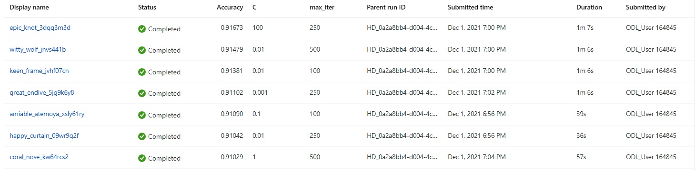
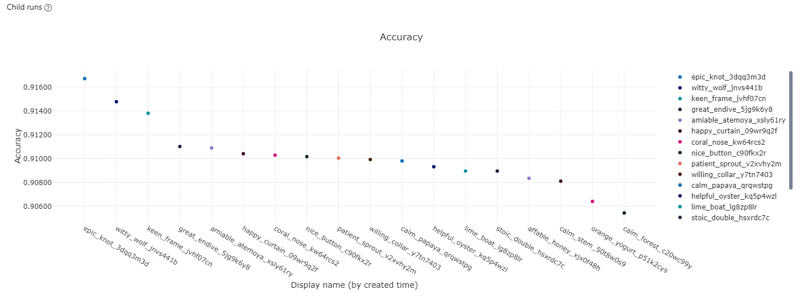
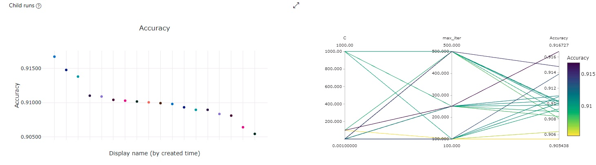

# Optimizing an ML Pipeline in Azure

## Overview
This project is part of the Udacity Azure ML Nanodegree.
In this project, we build and optimize an Azure ML pipeline using the Python SDK and a provided Scikit-learn model.
This model is then compared to an Azure AutoML run.

## Summary
**In 1-2 sentences, describe the model and hyperparameters generated by AutoML.**
The dataset contains anonymous data about marketing campaigns of a bank, mainly focusing on demographics. 
The labels are composed of two values ('yes' or 'no') on the column named 'y'. 
The best performing model was obtained using AutoML, with an accuracy close to 95%, achieving an improvement of around 3%
when compared to a Logistic Regressor with tuned hyperparameters.

## Scikit-learn Pipeline
We used a Logistic Regression model from Scikit-learn for performing classification, which we tuned using Hyperdrive.
The parameters we used for optimization where inverse regularization strength ('C') and
the maximum number of iterations ('max-iter'), aiming to get the best accuracy possible. 

For skewing and optimizing the different values of these parameters, we used random parameter sampler, which would help us find the
best combination of choices for both parameters. The usage of randomness reduces the need for extensive computation 
of performing grid search, while preserving good optimization capabilities.

For early stopping, we chose Bandit Termination Policy, which would stop the experiments once further ones can't improve the
primary metric above the slack-factor (we used 0.1, meaning it stops if new experiments can't improve accuracy and rather go below 10% of the best value).

The best performing combination, with its parameters and primary metric was:
```python
Best Run Id:  HD_0a2a8bb4-d004-4c6d-9327-a9a46bb10937_3
Regularization Strength: 0.1
Max iterations: 100
Accuracy 0.9109007040543822
```
The different metrics provided by AzureML showed how different trials behaved as we trained them. The images below show relationship between parameters and metric.

### Top runs and metrics


### Accuracy per run


### Relationship between hyperparameters and accuracy


## AutoML
**In 1-2 sentences, describe the model and hyperparameters generated by AutoML.**
The best performing model generated by AutoML was a XXXXX, achieving an accuracy close to 95%. AutoML automatically tried a compendium
of models and tuning, which was the main reason why the general performance was better than tuning only one model, as done in the
previous experiment.

## Pipeline comparison
The pipelines to train models where totally different, as well as the model architectures. While the Logistic Regressor demanded more domain knowledge and effort by the user,
AutoML takes a lot of effort out of the Data Scientist, by performing dozens or even hundreds of experiments with minimal customization. AutoML
just makes it much easier to try out many more models, that could be used later for more knowledgeable tuning, instead of going straight away for long-shots.

## Future work
There are many areas of improvement for next trials. Next time I will train a model, I would certainly go for AutoML on the first shot and 
afterwards try to play around with the best performing models. While a bit more computationally intensive and costly, 
AutoML could save me some time with experimentation, that I would rather use later for better tuning.

On the other hand, I would also play around more with the AutoML configuration class, to see what other kinds of metrics can be optimized
for other use cases, such as the percentage of data used for training and the primary metrics available.

## Proof of cluster clean up
The last line of the [Jupyter Notebook](udacity-project.ipynb) contains the relevant method for cleaning up resources.
```python
compute_target.delete()
```
