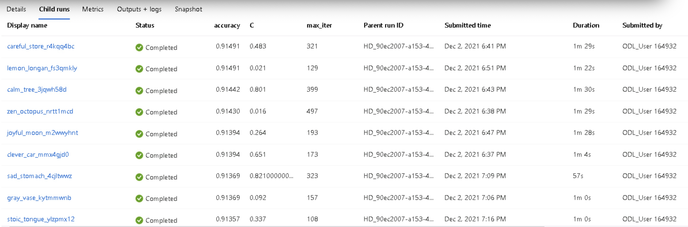
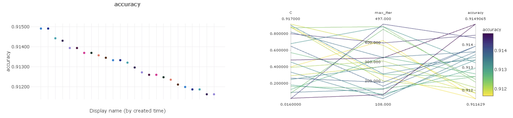
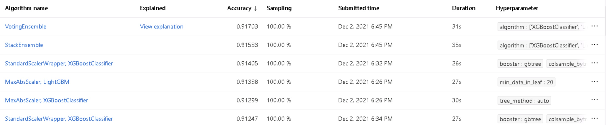
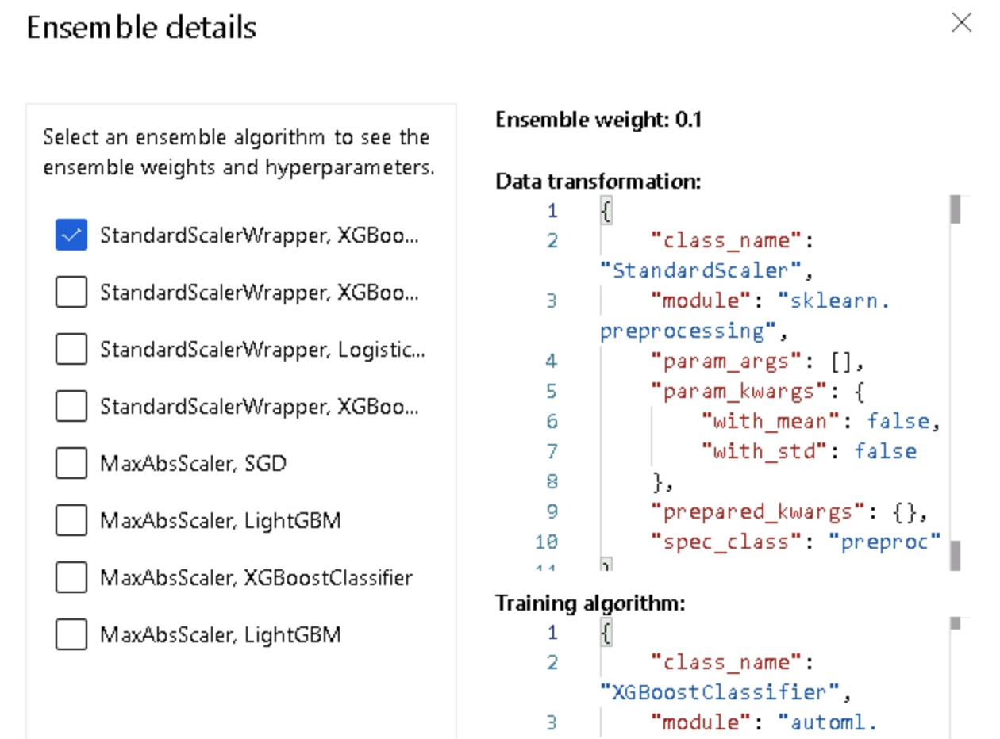
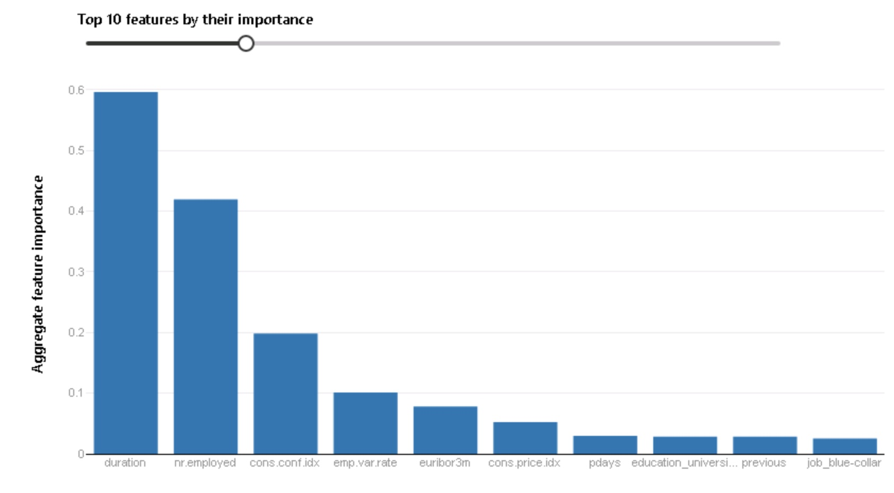

# Optimizing an ML Pipeline in Azure

## Overview
This project is part of the Udacity Azure ML Nanodegree.
In this project, we build and optimize an Azure ML pipeline using the Python SDK and a provided Scikit-learn model.
This model is then compared to an Azure AutoML run.

## Summary
The dataset contains anonymous data about marketing campaigns of a bank, mainly focusing on demographics. 
The labels are composed of two values ('yes' or 'no') on the column named 'y'. 
The best performing model was obtained using AutoML, with an accuracy close to 91.7%, achieving a slight improvement of 0.2%
when compared to a Logistic Regressor with tuned hyperparameters.

## Scikit-learn Pipeline
We used a Logistic Regression model from Scikit-learn for performing classification, which we tuned using Hyperdrive.
The parameters we used for optimization where inverse regularization strength ('C') and
the maximum number of iterations ('max-iter'), aiming to get the best accuracy possible. 

For skewing and optimizing the different values of these parameters, we used random parameter sampler, which would help us find the
best combination of choices for both parameters. The usage of randomness reduces the need for extensive computation 
of performing grid search, while preserving good optimization capabilities. For the inverse regularization strenght, I used
a random choice of 1000 values between 0.001 and 1, while on the other hand, for the maximum iterations, I used a random value between
100 and 500 iterations.

```python
ps = RandomParameterSampling(
    {
        'C': choice([x*0.001 for x in range(1,1000)]),
        'max_iter': choice(range(100, 500))
    }
)
```
For early stopping, we chose Bandit Termination Policy, which would stop the experiments once further ones can't improve the
primary metric above the slack-factor (we used 0.1, meaning it stops if new experiments can't improve accuracy and rather go below 10% of the best value).

As an outcome, we have two models which performed very well (see the table below), with exact same accuracy of 91.49%. Nevertheless, if I would pick
one of the two models, I would use the second in the list, as its inverse regularization parameter (C = 0.021) is greatly smaller than the first (C = 0.483), making this
a way more generalizable model than the first one.



The different metrics provided by AzureML showed how different trials behaved as we trained them. The images below show relationship between parameters and metrics.



As mentioned before, in this case if two models have similar accuracy, I would choose to use the one with smaller inverse regularization strenght ("C" parameter) as this would make my model more general and fit for unseen data.

## AutoML
The best performing model generated by AutoML was a Voting Ensemble, achieving an accuracy (same primary metric as our other experiment) close to 91.7%. AutoML automatically tried a compendium
of models and tuning, which was the main reason why the general performance was better than tuning only one model, as done in the
previous experiment. Below you can see which were the top models found by AutoML.



## Pipeline comparison
The pipelines to train models where totally different, as well as the model architectures. In this regard, in the Logistic Regressor tuning we had only one model and
had to take care of data preprocessing, while on AutoML the resulting model including an ensemble of XGBoost, Stochastic Gradient Descent, LightGBM and a Logistic Regressor,
each with different normalization techniques (standard scaling or maximum absolute scaling), which can be seen in the image below.



While the Logistic Regressor demanded slightly more domain knowledge and effort by the user, 
as you would have to have picked the model first and have a sense of how to manipulate its hyperparameters,
AutoML takes a lot of effort out of the Data Scientist, by performing dozens or even hundreds of experiments with minimal customization.
The pipeline chosen by AutoML also tried ensemble of models, resulting in the one we had. Additionally, in AutoML you get
a model explanation that also gave us details on the most important features considered in the model (see below).



## Future work
There are many areas of improvement for next trials. Next time I will train a model, I would certainly go for AutoML on the first shot and 
afterwards try to play around with the best performing models. While a bit more computationally intensive and costly, 
AutoML could save me some time with experimentation, that I would rather use later for better tuning once I chose one of the models.

On the other hand, I would also play around more with the AutoML configuration class, to see what other kinds of metrics can be optimized
for other use cases, such as the percentage of data used for training and the primary metrics available. Additionally, I'd like to 
improve in the sense of picking and inspecting other runs and saving them locally for later use.

## Proof of cluster clean up
The last line of the [Jupyter Notebook](udacity-project.ipynb) contains the relevant method for cleaning up resources.
```python
compute_target.delete()
```
