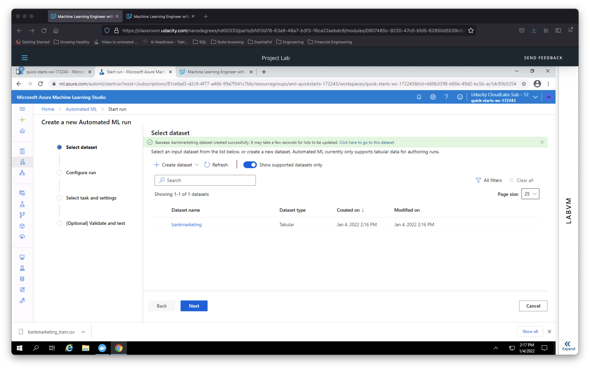
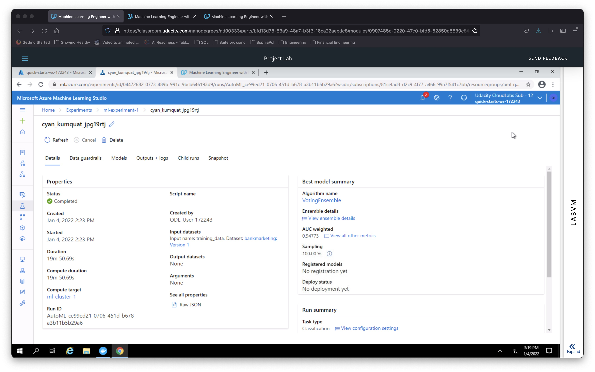
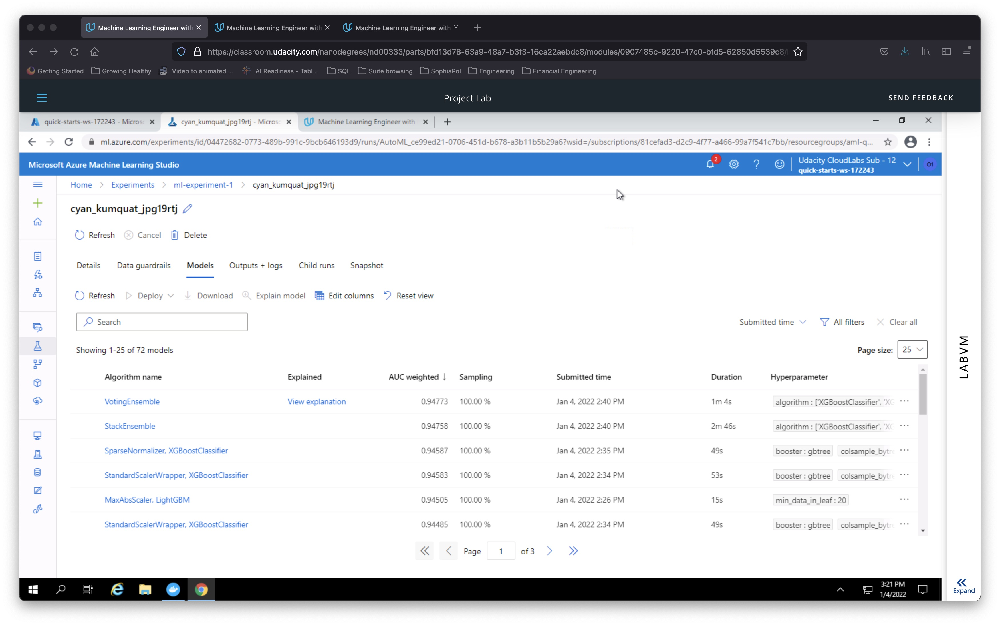
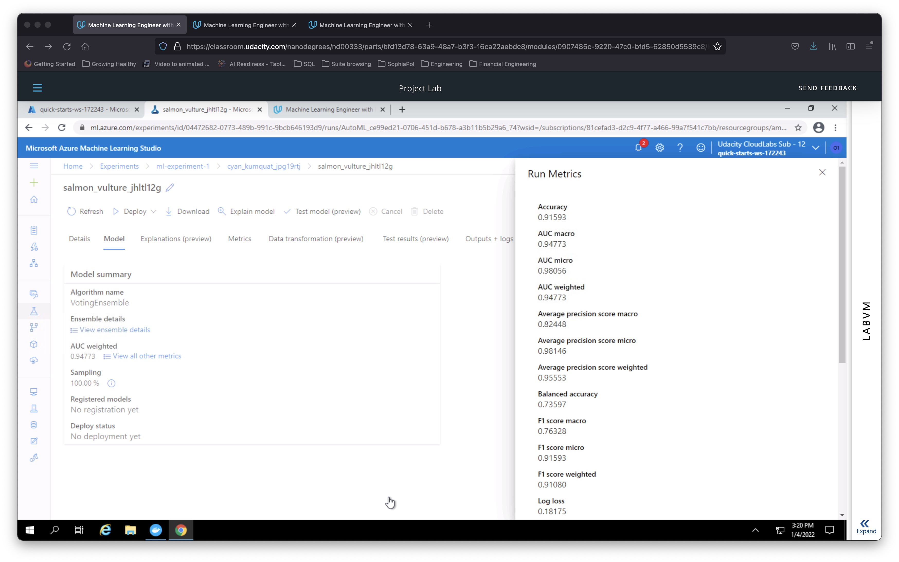
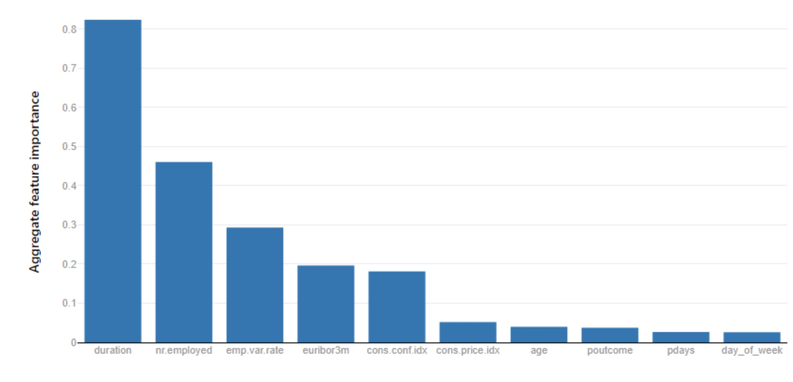
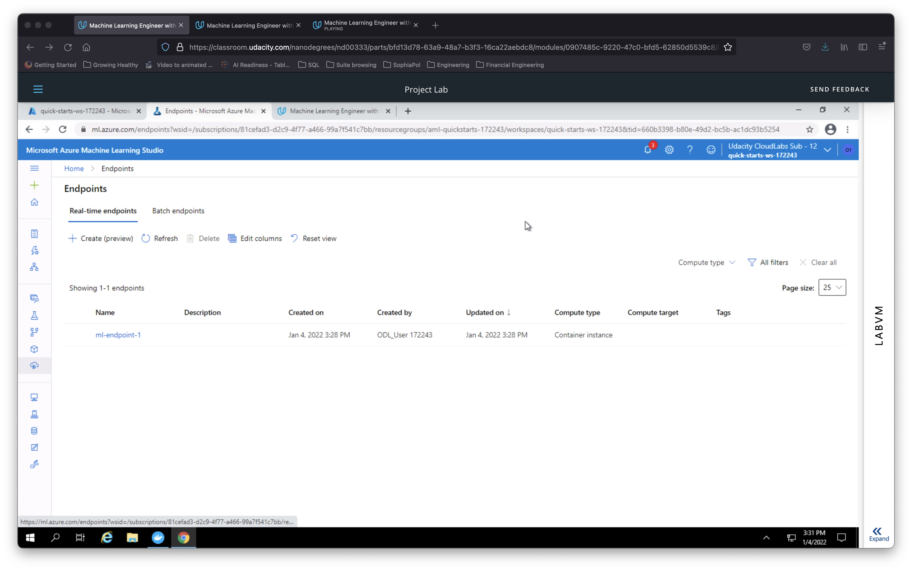
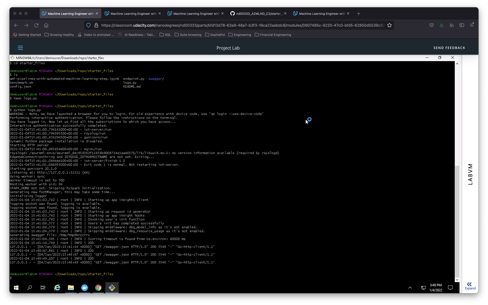
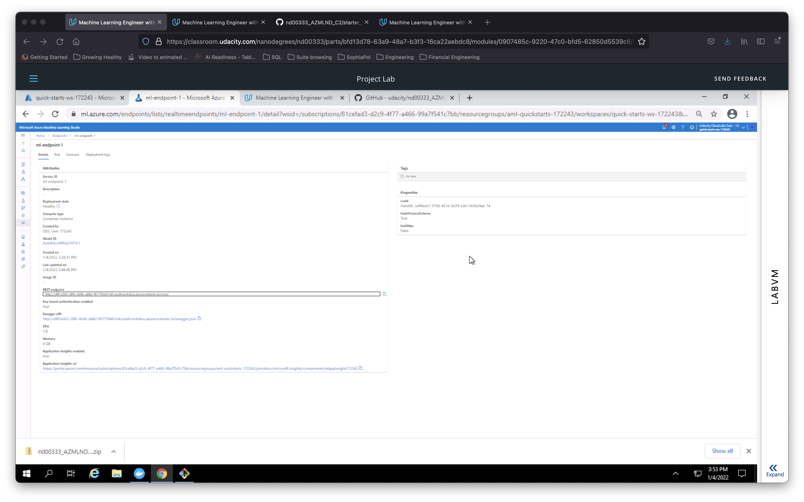
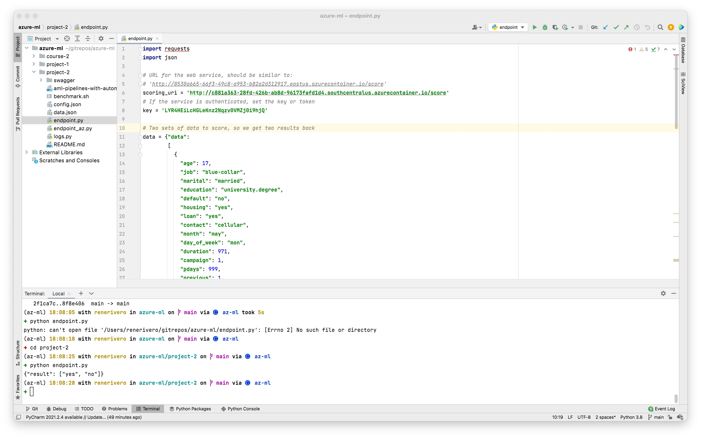
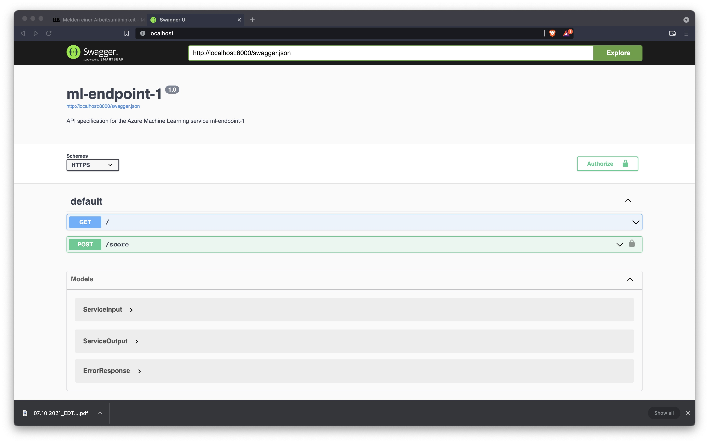

# Operationalizing Machine Learning
This project is part of Udacity's Machine Learning Engineer in Azure nanodegree, and consisted on using Azure to configure a ML model in production, deploy it with a REST endpoint for consumpion, test its use and create and publish a pipeline that will retrain the model with the use of another REST endpoint.

## Architectural Diagram
*TODO*: Provide an architectual diagram of the project and give an introduction of each step. An architectural diagram is an image that helps visualize the flow of operations from start to finish. In this case, it has to be related to the completed project, with its various stages that are critical to the overall flow. For example, one stage for managing models could be "using Automated ML to determine the best model".

## Key Steps
In this section we will deep-dive into all the processes and steps taken in the Azure cloud platform to achieve the project's objectives.

### Uploading the data
The data used for this project is the [Bank Marketing Dataset](https://automlsamplenotebookdata.blob.core.windows.net/automl-sample-notebook-data/bankmarketing_train.csv). The dataset was first downloaded and subsequently uploaded into Azure. The image below shows the mentioned dataset correctly uploaded into Azure Machine Learning Studio.

### Creating a Compute Cluster
Before creating an AutoML run, we need to provision relevant resources. For this we created a Compute Cluster with the following characteristics:
- Min nodes: 1
- Max nodes: 6
- Virtual Machine Size: `Standard_DS12_v2`

### Creating an Automated ML (AutoML) run
Now that we have a dataset for training and a virtual machine to run our experiment, we proceeded to create an AutoML run to try out a variety of models and pick the best performing one. We used the following settings to configure the AutoML run:
- Objective: Classification
- Target column: 'y'
- Exit criterion: 1 hour run
- Concurrency: 5 nodes

With these settings, we ran the experiment successfully as seen in the image below. The best model ended up being a VotingEnsemble with AUC weighted accuracy of 94.77%.

### Model comparison and metrics
One of the advantages of using AutoML, is the fact that it tries dozens or even hundreds of models and hyperparameter combinations, to see what works better for the task at hand. In the image below, we can see which were the best-performing models in this case.

**A total of 72 models were tried in this run!** This is massive, and here we can see the potential of using AutoML for quick results with machine learning. The top models seen in the image above range from LightGBM, XGBoost, StackEnsembles and (our best-performing model) a VotingEnsemble, each using different normalization steps, and requiring different training time (in the image we see a range from 15 seconds to 2 minutes required for training).

As we mentioned before, the best model in our case was a VotingEnsemble with 94.77% AUC weighted accuracy. We can see more metrics on this model in the image below.

It is also possible to go deeper into explaining the best model. For this we needed to check the box `explain best model` before doing the automated run. One of the most useful features (in my opinion) is to understand what are the most decisive features for our predictions. In the image below, we see which are the Top 10 features in this regard from our Bank Marketing Dataset. The most important feature to making predictions seems to be the duration of clients within the bank.

### Model deployment to a REST endpoint
For our best model to be used by other apps or in `production`, we need to make this machine learning model available. A great way to do this is provisioning predictions through a REST endpoint using authentication. Doing this with Azure ML takes only a few minutes and a couple clicks, and voilá! You have a managed endpoint for your model. The image below shows the VotingEnsemble model above, deployed correctly to a REST endpoint provisioned through a compute instance.

### Enabling Application Insights
Application Insights is a log service that can be enabled both through the Azure ML Studio platform directly, or using Azure Python SDK. We used the latter to enable this feature that is commonly used to debug a deployed model. The code used for this purpose can be found in [`logs.py`](logs.py) file, which uses a config.json file to get the Workspace details and we pass in the endpoint name in order to activate the logs. In the image below, we can observe that after running `logs.py` file we get some logs responses as expected.

We can also see that after running correctly the above script, we see that Application Insights is correctly set up and running if we inspect the endpoint in Azure ML Studio (see the last two values from the image - Application Insights Enabled: True).

### Testing the endpoint
In order to test our endpoint, we use the script in [`endpoint.py`](endpoint.py). For this, we needed to replace the endpoint URL and the relevant Bearer Key for authentication. This script sends in two data points and returns a list of predictions. The image below shows the mentioned script being ran with PyCharm (a popular Python IDE) and the expected predictions of our endpoints being printed as a response.

### Documenting the endpoint with Swagger
For others to be able to use an endpoint, it's important to document the expected type and fields of your HTTP requests. For this purpose `Swagger` is a great and easy choice greatly supported by Azure. In this project we used it to document our `GET` and `POST` endpoints, by first downloading a [`swagger.json file`](swagger/swagger.json), then running the [`swagger.sh script`](swagger/swagger.sh) that uses Docker to pull and provision a Swagger image, and then using [`serve.py script`](swagger/serve.py) to serve it to a local port. In the image below, you can see the `Swagger` documentation correctly served.

If you would like to see a longer screenshot of the Swagger documentation created, feel free to checkout this [bigger screenshot](assets/swagger_endpoints.png), that features the expanded explanations of the `GET` and `POST` endpoints, but that is not rendered in this README file as it is too long.

### Creating and deploying a pipeline

## Screen Recording
In order to demonstrate the above mentioned steps, we also provide a screencast recoding. The video can be found [in Youtube using this link]() and it features a demo of most of the resources mentioned above.

## Standout Suggestions
Since we used the provided Virtual Machines of Udacity to access Azure, the optional section of creating a service principal and authenticate to it was not possible nor relevant. While we also do not provide the optional Apache Benchmark results, we did replace the relevant REST endpoint URI and Bearer Key on the [`benchmark.sh`](benchmark.sh) file script.